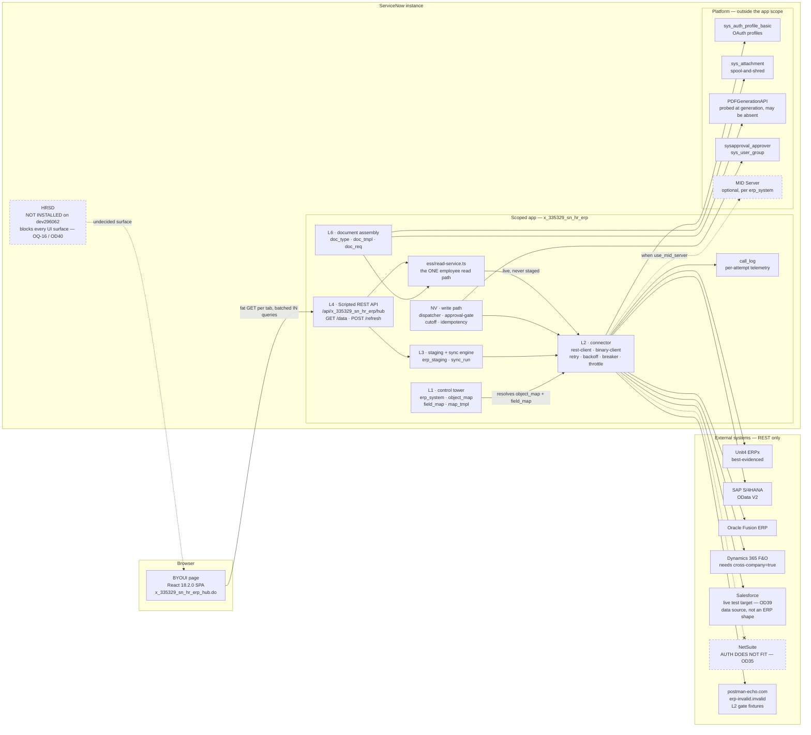
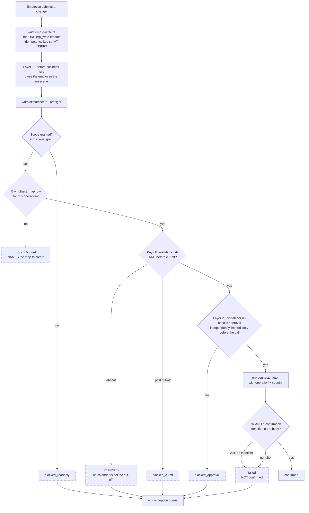

# SN HR&ERP

A ServiceNow scoped application (`x_335329_sn_hr_erp`) that connects to **any ERP over REST**,
stages the data into ServiceNow with full provenance, renders it in a five-tab consolidated hub,
and generates HR documents from ERP employee and payroll data — on an instance where the **HR
module is not installed**.

Built with the [ServiceNow Fluent SDK](https://www.servicenow.com/docs/bundle/zurich-application-development/page/build/servicenow-sdk/concept/servicenow-sdk-intro.html)
(`@servicenow/sdk` 4.9.0) as metadata-as-code.

---

## What it does

**Connects to any ERP.** A hand-rolled REST connector with retry, exponential backoff, a circuit
breaker and per-attempt telemetry. Per-vendor default field mappings mean adding a second ERP is a
data change, not a code change — proven at the L1 gate with an empty `sys_metadata` delta.

**Stages with provenance.** Every staged row carries its source system, ERP category, logical
object, fetch time and sync run. Payroll and employee profile are the deliberate exception: they
are fetched **live at document-generation time and never stored**.

**Renders honestly.** Five tabs — Financial, Procurement, Inventory, Fixed Assets, Manufacturing.
No CRM or sales content. Every tile resolves to one of four states and says which one it is.

**Generates HR documents.** Employment verification letters and salary certificates, assembled
from ERP data against templates whose placeholders map to *logical* fields — so swapping SAP for
Unit4 changes mappings, not templates.

---

## The four-state contract

This is the point of the application, not a feature of it.

| State | What the tile does |
|---|---|
| **live** | Shows the figure and when it was fetched |
| **not configured** | **Names the object map to create.** Shows no number |
| **failed** | Says the ERP did not answer. Shows the last known figure with its age, or says there is none |
| **stale** | Shows the figure **with its age**, past the configured threshold |

Plus `partial` (some systems answered) and `restricted` (the caller lacks `finance_viewer`, and
the figure is absent from the response body entirely — not hidden client-side).

**`0` is rendered only when an ERP genuinely returned zero.** A tile that shows `0` because a
field was never mapped is the failure this application exists to prevent: nobody investigates a
number.

### The five rules

> **Never** draw a button that can't commit its decision.
> **Never** label HTML as PDF.
> **Never** display `0` for an absence.
> **Never** ship a test driver armed.
> **Never** seed an invented endpoint or field name. Blank beats wrong.

---

## Architecture

```
L0  scaffold, roles, ACL shape
L1  control tower — erp_system, object_map, field_map, mapping_template
L2  connector runtime + vendor default-mapping resolution
L3  staging tables + sync engine + provenance
L4  Scripted REST API — one fat GET /data per tab, batched IN queries, never N+1
L5  BYOUI page — bundled React 18.2.0 SPA, five tabs
L6  HR document generation
L7  requisition write-back — DEFERRED, unapproved (D3)

NV  Noviq employee services — the first ERP WRITES in this repo (OD42)
```

`NV` is an increment on top of L0–L6, built from a client BRD/TRD: payslip retrieval, leave,
personal and banking data, HR documents and the write-back they need. It reverses D3 **for that
scope only** — Tab 2's requisition write-back stays deferred and no Approve/Reject control is
drawn anywhere. See `docs/noviq/`.

```
src/fluent/    tables, ACLs, roles, properties, navigation   (.now.ts metadata-as-code)
src/server/    connector/ sync/ api/ hr/ contract/            (runtime modules)
src/server/    write/ ess/                                   (NV: the governed write path + reads)
src/client/    React SPA bundled into the BYOUI page
docs/          spec, per-layer designs, decisions, build reports
```

Roles: `viewer`, `finance_viewer`, `hr_viewer`, `admin` — **none implies any other**.
`finance_viewer` gates every monetary figure on every tab.

---

## How it works

Two diagrams. The first is what connects to what; the second is the only part that changes data in
somebody else's system, and is drawn separately because refusing correctly is the point of it.

### System context



**Everything crosses one boundary.** `erp-connector.fetch()` is the only way out of this app. A
dispatcher issuing its own `RESTMessageV2` would be shorter and would forfeit retry
classification, backoff, the circuit breaker, `Retry-After` and `call_log` — so a second HTTP path
is a defect, not a shortcut (OD42). `npm run check` rule 8a fails one on sight.

The connector carries **no vendor knowledge**. Which endpoint to call and which field means what
both come from `object_map` + `field_map` rows, which is why the L2 gate can run entirely against
`postman-echo.com` and why adding a vendor is a data change, not a code change.

`binary-client.ts` is a separate file rather than a branch, because `getBody()` is unusable on a
response saved as an attachment — the JSON path and the binary path cannot share a response reader
without one of them being silently wrong.

### The write path — what has to be true before a request leaves



Four things in that diagram are load-bearing:

- **The approval gate is checked twice, and layer 2 is not a business rule.** A `before` rule that
  throws is silently swallowed on this platform and the record saves — a crashed rule is
  indistinguishable from an approving one. Layer 2 sits outside the rule engine, so a crash cannot
  lift it (OD44).
- **The three `blocked_*` states never collapse into one `blocked`.** Read-only is a configuration
  choice, cut-off is a timing outcome, approval is a governance outcome. The reason is the only
  part the employee and the auditor actually need.
- **A 2xx is not success.** "The ERP accepted my request" and "the ERP recorded my change" are
  different claims, and only the second is worth telling somebody.
- **No payload value is ever stored.** `erp_write` keeps a `request_hash`. A salary or an IBAN in
  the audit table recreates the shadow database this application exists to prevent.

---

## Getting started

```bash
npm install
npx now-sdk auth --add https://<instance>.service-now.com --type basic --alias dev
npm run build && npx now-sdk install -a dev
```

Then open `https://<instance>.service-now.com/x_335329_sn_hr_erp_hub.do`.

`now-sdk install` does **not** build. Always `build && install`.

```bash
npm run check     # contract + NV logic + data minimisation + Store readiness
```

Four static suites, run against a stubbed Glide. Three of their rules exist because each caught a
real, shipped defect: a write that resolved the *read* `object_map` row and reported `confirmed`
for a request that never left the instance; every audit row inserted with a blank idempotency key
under a unique index; and three divergent country-fallback rules where there should be one. **None
of them are style rules — do not suppress one to make a build pass.**

### Connecting an ERP

1. Create an `erp_system` record — vendor, base URL, auth type, pagination style, date format,
   response root.
2. Apply the vendor's `mapping_template`, or create `object_map` + `field_map` rows by hand.
3. Run a sync (every job ships disarmed — see **Status**).

`docs/USER-GUIDE.md` walks all of this task by task, including the diagnostic table and what the
application deliberately cannot do.

#### Vendor support

`docs/vendor-integration-research.md` profiles seven vendors — auth flow, endpoints, pagination,
date format, response root, error shape, and what a human must supply per vendor.

| Vendor | Fit |
|---|---|
| **Unit4 ERPx** | Clean, and the best-evidenced. ObjectAPI `limit`/`offset`, bare-array body. Runbook: `docs/unit4-integration.md` |
| **SAP S/4HANA** | Clean. OData V2 `d.results`, `$skip`/`$top`, `A_`-prefixed entity sets |
| **Oracle Fusion ERP** | Fits |
| **Dynamics 365 F&O** | Fits (OData). Needs `cross-company=true` or it silently reports one legal entity |
| **Salesforce** | Data source only, not an ERP shape. Enabled as the live test target (OD39). Runbook: `docs/salesforce-integration-design.md` |
| **NetSuite** | **Auth does not fit** — signed-JWT / OAuth 1.0a, which the connector cannot perform (OD35) |
| **Infor CloudSuite, Workday Financials** | Dropped — documentation behind a customer login |

Shipped `mapping_template` rows carry **structural hints only**. Nine SAP and Unit4 endpoints are
verified against published documentation and cite their source in `source_note`; the rest are
blank on purpose. **No `field_map` payload is shipped for either vendor** — no property name for
either is publicly reachable, and a guessed one renders a confident wrong number. See
`docs/decision-log.md` OD37.

> **Check `field_map` against a real response before setting `active = true`.** A wrong mapping
> does not fail loudly. This is the single riskiest action in the application.

---

## The write path

`NV` is the first thing here that changes data in someone else's system, so it is built to refuse
rather than to succeed. Five properties hold it up:

| Property | Why it exists |
|---|---|
| Every write goes through the existing connector | Retry classification, backoff, circuit breaker, `Retry-After` and per-attempt telemetry already live there. A second HTTP path would forfeit all of it |
| **A 2xx is never success on its own** | No confirmable identifier in the response means `failed`. "Accepted my request" and "recorded my change" are different claims |
| Three distinct `blocked_*` states | Read-only, payroll cut-off and missing approval are different reasons. One generic `blocked` destroys the only thing the auditor needs |
| The approval gate is enforced twice | A `before` business rule that throws is silently swallowed on this platform. The second layer is not a rule, so a crash cannot lift it |
| No payload value is ever stored | The audit row keeps a hash, never the body. A salary in the audit table is the shadow database this app exists to avoid |

An **absent payroll calendar refuses the write** rather than assuming no cut-off applies. An
absence is never read as a permission — the same rule as `0` never standing in for "unknown".

## Status

All six build layers are **deployed**. **Almost none of the code has ever executed**: `call_log`
is 0 rows, `erp_staging` and `sync_run` are empty, and no layer gate or test has been run.

**All 52 `NV` stories are built or explicitly deferred** — schema, ACLs, the governed write path,
the shared employee read path, document generation and the governance gates all compile clean and
pass four static check suites. What is *not* built is the business-rule layer for five of the early
stories, and every UI surface — the latter blocked on one undecided question (OQ-16 / OD40): HRSD
is not installed on this instance, so the surface these stories render into is not settled.

`docs/TODO.md` is the ordered list of what remains and what each item is worth.
`docs/noviq/BUILD-LOG*.md` is the honest per-story state; trust those over any summary, including
this one.

**All 10 scheduled jobs ship `on_demand` + `active: false`.** Nothing runs until a human runs it.
"Nothing happened" is the designed default, not a fault — and a driver must never be left armed.

**There is a deploy backlog**, but it is no longer blocked. The SDK credential store now holds the
`dev` alias, so `npm run build && npx now-sdk install -a dev` can run. Everything since the
`payload.k` envelope fix — the styling and theme pass, nine bug fixes, the OD37 seed corrections
and the entire NV increment — is built clean and still not installed.

The L1 control tower is populated on the instance: **6 `erp_system` rows, 14 `object_map` rows and
22 `field_map` rows**, with the three L2 gate fixtures intact and every system pointed at
`postman-echo.com` or a deliberately invalid host. `sync_run` and `call_log` are **0 rows** — the
wiring is there and has never been used.

`docs/DEFERRED.md` is the authoritative list of what is blocked, unverified, or postponed —
including the items that need a human at a browser. `docs/BUGS.md` carries known defects and their
fix status.

A clean build proves nothing. A passing happy-path fixture proves nothing. The most valuable next
action is running `HRERP L2 GATE (temporary)` once: it is the first real proof the connector
works, and it takes about a minute. Two of the riskiest repairs in the repo — a write resolving the
wrong `object_map` row, and every audit row sharing one blank idempotency key under a unique index
— are fixed, guarded against regression, and **still unconfirmed against a live call**.

---

## Documentation

| File | Contents |
|---|---|
| `CLAUDE.md` | Working rules, commands, and the trap list for anyone (or anything) editing this repo |
| `docs/TODO.md` | What is left, in the order it is worth doing |
| `docs/MANUAL-TEST-SCENARIOS.md` | What to click, in what order, and what each result means |
| `docs/USER-GUIDE.md` | What an operator can do and how — read the hub, connect an ERP, run a sync, generate a document, diagnose |
| `docs/SESSION-RESUME.md` | Cold-start state of the instance and the build |
| `docs/DEFERRED.md` | Everything blocked, unverified, or postponed |
| `docs/decision-log.md` | Every decision with its rejected alternative |
| `docs/api-contract.md` | The binding L4↔L5 payload shape |
| `docs/stories.md` | 38 stories, 189 acceptance criteria |
| `docs/vendor-integration-research.md` | Per-vendor ERP integration profiles |
| `docs/noviq/stories.md` | The 52-story Noviq backlog, with falsifiable acceptance criteria |
| `docs/noviq/architecture.md` | Technical design; §0 lists what the story coverage matrix hid |
| `docs/noviq/BUILD-LOG*.md` | What is actually built, per session, per story |
